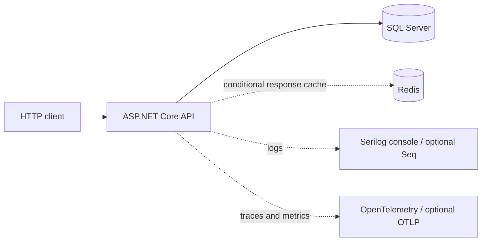
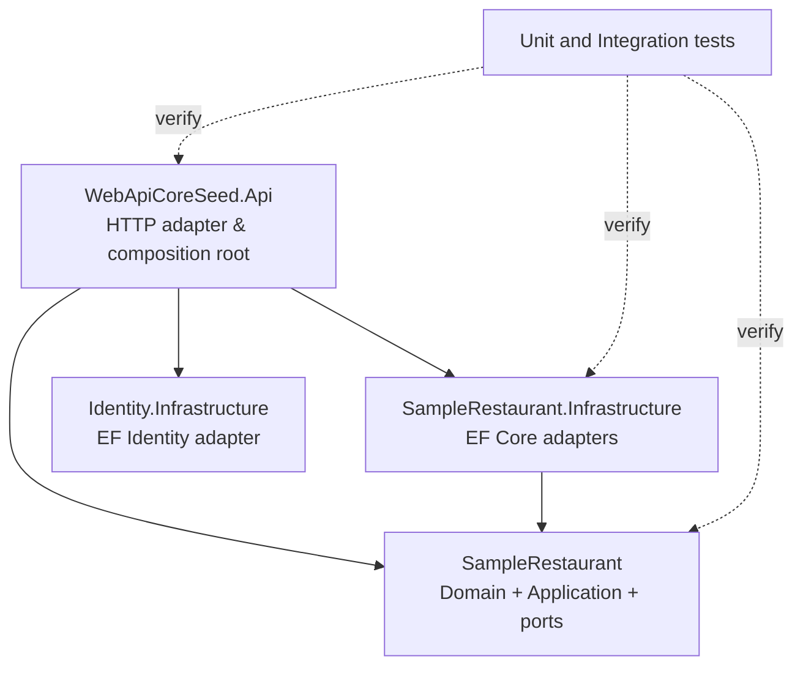
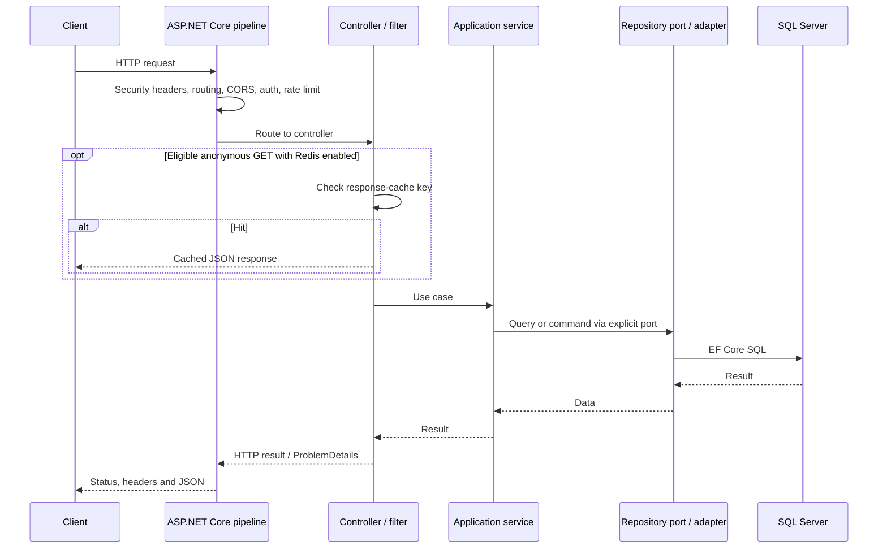

# Architecture and request flow

[English](architecture.md) | [Português (Brasil)](architecture.pt-BR.md) | [Back to README](../README.md)

> Scope: the maintained **.NET 10 application** on `main`. This is a map of code that exists today, not a promise of a fully isolated multi-module platform.

## System context

- API project: `src/WebApiCoreSeed.Api`. `Program.Main` configures the web host, dependency injection and request pipeline.
- Identity infrastructure: `src/Modules/Identity/WebApiCoreSeed.Identity.Infrastructure`. Owns the Identity EF Core context, design-time factory and migrations.
- SampleRestaurant core: `src/Modules/SampleRestaurant/WebApiCoreSeed.SampleRestaurant`. Defines domain types, use-case services, input/output ports and validation.
- SampleRestaurant infrastructure: `src/Modules/SampleRestaurant/WebApiCoreSeed.SampleRestaurant.Infrastructure`. Owns its EF Core context, repositories, mappings, migrations and Unit of Work.
- Tests: `tests/WebApiCoreSeed.UnitTests` and `tests/WebApiCoreSeed.IntegrationTests` (the latter uses SQL Server/Redis Testcontainers).
- Generated API specifications: `tools/OpenApiGenerator` and `docs/openapi`.

## Dependency direction

Application services depend on explicit repository ports such as `IPratoRepository` and `ISampleRestaurantUnitOfWork`; infrastructure implements them. The API assembles concrete implementations in `Configuration/DependencyInjectionConfig.cs`. The domain/application project does **not** depend on EF Core, ASP.NET Core or the concrete Infrastructure adapter. This is **modular/hexagonal directionality with pragmatic boundaries**, not separate deployable microservices.

Current limitations: the Identity application flow remains in the API adapter; some sample HTTP view models remain in the API. Do not describe these boundaries as independently deployable or assume all business modules have been extracted.

## HTTP request flow

`Program.cs` calls `AddApiServices`, then `UseApiPipeline`, both defined in `Configuration/HostingConfig.cs`. The runtime pipeline includes forwarded-header configuration, centralized exception handling, Serilog, security headers, compression, HTTPS redirection, static files, routing, CORS, request timeouts, cookie policy, authentication, rate limiting, authorization, MVC endpoints, OpenAPI and health checks. It emits RFC-style `ProblemDetails` for supported error paths.

### Authentication and authorization

ASP.NET Core Identity is stored in `ApplicationDbContext`. API v2 exposes anonymous `POST /api/v2/entrar` for JWT login; v1 login is deprecated. Authorized endpoints use JWT Bearer and optional claim checks. The v1 `nova-conta` action is currently protected by `[Authorize]`: **do not document it as public registration**. The development seed provides a deterministic local user instead.

### Caching

`RedisCacheSettings:Enabled` controls Redis integration; the `[Cached]` action filter only uses shared entries for eligible anonymous GET requests without authorization or cookie headers. Failed, canceled, non-200 and cookie-setting responses must not be stored. Redis keys are SHA-256 based and include the request path and query values. Cache freshness and eligibility are implementation concerns; the cache is **not** an authorization boundary.

### Persistence and migrations

`ApplicationDbContext` and `SampleRestaurantDbContext` are separate logical contexts that can share a local SQL Server database. Each maintains its own migration history in its Infrastructure project. The `migrations` Compose service applies both sets in sequence. Do not call `EnsureCreated` for a schema managed by migrations. Consult [migrations](development/ef-core-migrations.md).

### Observability and security

- Serilog emits console logs and optional Seq/file output.
- OpenTelemetry instruments ASP.NET Core, HTTP client, EF Core and runtime metrics, with optional OTLP export. Export is **off** by default.
- CORS allowed origins are explicit; rate limits separate public, authenticated and authentication-sensitive requests.
- Security middleware emits CSP, `X-Frame-Options: DENY`, `X-Content-Type-Options`, `Referrer-Policy` and `Permissions-Policy`. IIS `web.config` declares `X-Frame-Options` separately.
- Secrets must be supplied via User Secrets, environment variables or a production secret manager, not committed to the repository.

## Configuration matrix

| Key / prefix | Purpose | Notes |
| --- | --- | --- |
| `ConnectionStrings:DefaultConnection` | SQL Server | Required to start |
| `AppSettings:Secret` | JWT signing | Required; never commit |
| `AppSettings:Emissor` / `ValidoEm` | JWT issuer/audience | Must match issued tokens |
| `Cors:AllowedOrigins` | Allowed origins | Empty by default |
| `NativeRateLimitingSettings` | Quotas and windows | Per policy in config |
| `RedisCacheSettings` | Redis response cache | Enabled in default appsettings; configure connection |
| `OpenTelemetry` | Traces, metrics, OTLP | OTLP exporter off by default |
| `SeqSettings` | Serilog sinks | Seq disabled by default |
| `ForwardedHeaders` | Proxy forwarding | Disabled by default |
| `RequestLimits` | Timeout and body size | Enforced by host pipeline |

See [`src/WebApiCoreSeed.Api/appsettings.json`](../src/WebApiCoreSeed.Api/appsettings.json), [local development](development/containerized-local-development.md) and the [quality gates](quality-gates.md).

## Architectural decisions

The [ADR index](adr/README.md) explains the rationale for explicit ports, bounded migrations/seed and runtime security/telemetry. The historical .NET Core 3.1 design and migration constraints are described in the [legacy migration guide](migration-from-legacy.md).