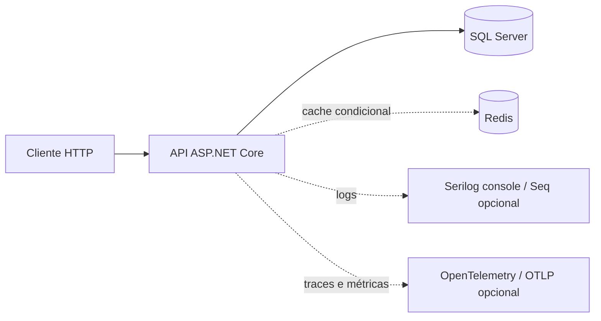
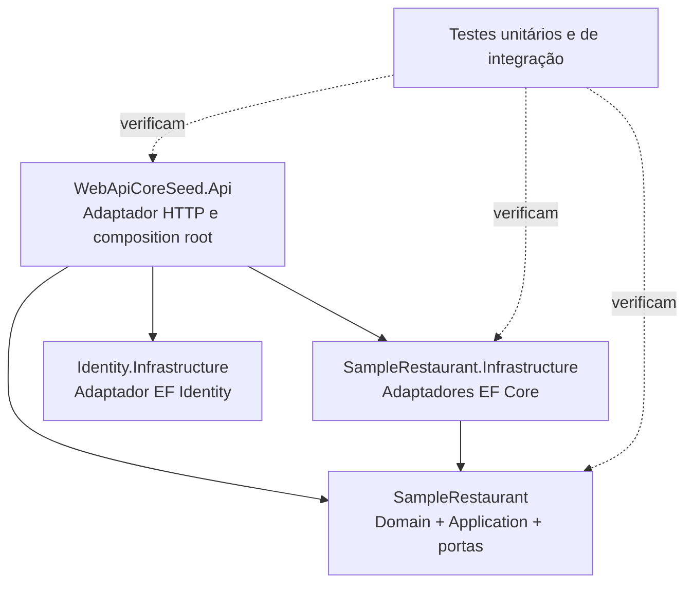
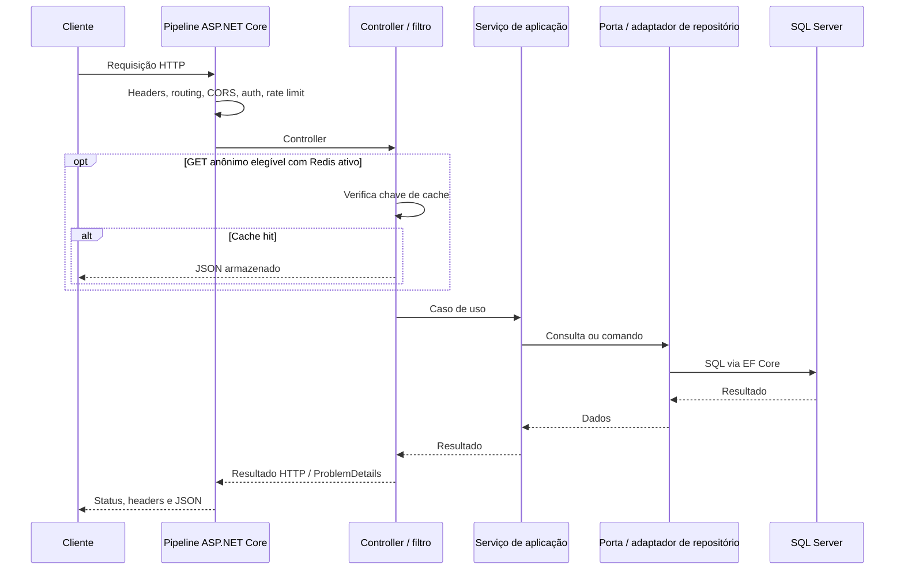

# Arquitetura e fluxo de requisição

[English](architecture.md) | [Português (Brasil)](architecture.pt-BR.md) | [Voltar ao README](../README.pt-BR.md)

> Escopo: aplicação mantida em **.NET 10** na `main`. Este documento descreve o código existente, não uma plataforma de microsserviços independentes.

## Contexto do sistema

- API: `src/WebApiCoreSeed.Api`. O `Program.Main` configura host, injeção de dependências e pipeline.
- Identity Infrastructure: `src/Modules/Identity/WebApiCoreSeed.Identity.Infrastructure`. Contém contexto EF Core do Identity, factory design-time e migrations.
- Núcleo do SampleRestaurant: `src/Modules/SampleRestaurant/WebApiCoreSeed.SampleRestaurant`. Contém entidades, casos de uso, portas de entrada/saída e validações.
- Infraestrutura do SampleRestaurant: `src/Modules/SampleRestaurant/WebApiCoreSeed.SampleRestaurant.Infrastructure`. Contém EF Core, repositories, mappings, migrations e Unit of Work.
- Testes: `tests/WebApiCoreSeed.UnitTests` e `tests/WebApiCoreSeed.IntegrationTests`; estes usam SQL Server e Redis via Testcontainers.
- Contratos da API: `tools/OpenApiGenerator` e `docs/openapi`.

## Direção das dependências

Os serviços de aplicação dependem de portas de repositório explícitas, como `IPratoRepository` e `ISampleRestaurantUnitOfWork`; a infraestrutura as implementa. A API compõe os serviços em `Configuration/DependencyInjectionConfig.cs`. O projeto de domínio/aplicação não depende de EF Core, ASP.NET Core ou infraestrutura concreta. Trata-se de **arquitetura modular/hexagonal com limites pragmáticos**, não de microsserviços implantáveis separadamente.

Limitações: os fluxos de autenticação do Identity ainda residem na API; alguns view models HTTP do exemplo também. Esses limites não representam módulos totalmente independentes.

## Fluxo de requisição HTTP

`Program.cs` chama `AddApiServices` e `UseApiPipeline`, em `Configuration/HostingConfig.cs`. O pipeline inclui forwarded headers, exceptions centralizadas, Serilog, headers de segurança, compressão, redirecionamento HTTPS, arquivos estáticos, routing, CORS, timeouts, política de cookies, autenticação, rate limiting, autorização, endpoints MVC, OpenAPI e health checks. Erros elegíveis retornam `ProblemDetails`.

### Autenticação e autorização

ASP.NET Core Identity utiliza `ApplicationDbContext`. A API v2 expõe `POST /api/v2/entrar` anônimo e retorna JWT; o login v1 é depreciado. Outros endpoints exigem Bearer JWT e, quando aplicável, claims. A ação `nova-conta` v1 é protegida por `[Authorize]`: **não é cadastro público**. O seed fornece um usuário local determinístico.

### Cache

`RedisCacheSettings:Enabled` habilita o Redis. O filtro `[Cached]` só compartilha respostas de GET anônimo elegível e sem cabeçalhos de autorização/cookie. Não armazena respostas com falha, canceladas, diferentes de 200 ou que definam `Set-Cookie`. As chaves incorporam caminho/parâmetros e usam SHA-256. Cache **não** substitui autorização.

### Persistência e migrations

`ApplicationDbContext` e `SampleRestaurantDbContext` são contextos separados, podendo utilizar o mesmo banco local. Cada um mantém suas migrations em seu projeto de Infrastructure. O Compose aplica as duas em sequência. Não use `EnsureCreated` em um esquema administrado por migrations. Veja [migrations](development/ef-core-migrations.pt-BR.md).

### Observabilidade e segurança

- Serilog envia logs ao console e opcionalmente ao Seq/arquivo.
- OpenTelemetry instrumenta ASP.NET Core, cliente HTTP, EF Core e métricas de runtime. Exportação OTLP é **desabilitada** por padrão.
- Origens do CORS explícitas; rate limiting nativo com políticas pública, autenticada e sensível à autenticação.
- Middleware emite CSP, `X-Frame-Options: DENY`, `X-Content-Type-Options`, `Referrer-Policy` e `Permissions-Policy`. O `web.config` do IIS também declara `X-Frame-Options`.
- Secrets vêm de User Secrets, variáveis de ambiente ou gerenciador de segredos em produção; jamais do repositório.

## Matriz de configuração

| Chave / prefixo | Finalidade | Observação |
| --- | --- | --- |
| `ConnectionStrings:DefaultConnection` | SQL Server | Obrigatório |
| `AppSettings:Secret` | Assinatura JWT | Obrigatório; segredo |
| `AppSettings:Emissor` / `ValidoEm` | Emissor/audiência JWT | Precisam coincidir com o token |
| `Cors:AllowedOrigins` | Origens permitidas | Vazio por padrão |
| `NativeRateLimitingSettings` | Quotas e janelas | Por política |
| `RedisCacheSettings` | Cache de resposta | Ativo no appsettings padrão; requer conexão |
| `OpenTelemetry` | Traces, métricas, OTLP | Exportação OTLP desativada por padrão |
| `SeqSettings` | Sinks de log | Seq desativado por padrão |
| `ForwardedHeaders` | Proxies reversos | Desabilitado por padrão |
| `RequestLimits` | Timeout e tamanho do corpo | Aplicados pelo host |

Consulte [appsettings.json](../src/WebApiCoreSeed.Api/appsettings.json), [ambiente local](development/containerized-local-development.md) e [quality gates](quality-gates.md).

## Decisões arquiteturais

O [índice ADR](adr/README.md) registra decisões sobre portas explícitas, migrations/seed e segurança/telemetria. O legado .NET Core 3.1 e suas limitações estão no [guia de migração](migration-from-legacy.pt-BR.md).